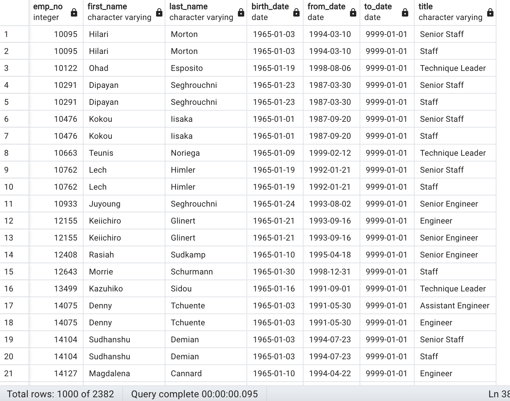

# Pewlett Hackard Analysis

## Tools Used
• SQL

• PGAdmin

## Purpose and Overview

Pewlett Hackard needs to prepare ahead for vacancies and we need to understand how many people will be retiring in the next year and who. To perform this analysis, we used SQL, QuickDBD and PGAdmin to identify employees who were nearing retirement age and then organize that into a list by department and title. This way, the company can see which departments will be most affected and then prepare for the upcoming change.

## Results

### Deliverable 1: 
• The first list of retiring employees shows more than 133,000 results. However, many of the names are repeated since the employees may have held many positions

• When we apply the SELECT DISTINCT ON function with the employee number, we find that the list of retiring employees shrinks down to about 90,000

• From there, we filtered the data to find out which titles were going to see the most amount of employees retiring. These were the results

### Deliverable 2:
• Many of the retiring employees may be eligible for the company's mentorship program. To find the employees eligible, we filtered the data for retiring employees born in the year 1965

## Summary

From the data gathered from the unique_titles table, a little over 90,000 positions will need to be filled as employees retire. Many of those retiring are in senior positions and so they will need to train large amounts of younger employees to fill their roles before they retire. This analysis demonstrates the need for companies to predict not only potential problems with labor, but with other sectors of their business as well.
